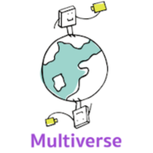

# Multiverse

* Multiverse is a tutoring service on-demand app for UCSD people to provide and receive tutoring services from each other.
* Check-out demo video here: https://youtu.be/28nGeTmY35c

## Dev Environment SetUp 
* Multiverse is a [React Native](https://facebook.github.io/react-native/docs/getting-started) project, using [Expo (SDK33)](https://docs.expo.io/versions/v33.0.0/).
* So far, Multiverse code base does not use any native iOS code (i.e it is fully React Native) so neither macOS nor Xcode is required. You can use any machine/OS or IDE/text editor of your choice.

### MacOS
1. Install [Node Version: 10.16.3 (includes npm 6.9.0)](https://nodejs.org/en/download/)
2. Install Expo CLI command line interface
   - `npm install -g expo-cli`
3. Install [Homebrew](https://brew.sh/)
4. Install Yarn
   - `brew install yarn`

### Windows
1. Install [Node Version: 10.16.3 (includes npm 6.9.0)](https://nodejs.org/en/download/)
2. Install Expo CLI command line interface
   - `npm install -g expo-cli`
3. Install [Chocolatey](https://chocolatey.org/install#installing-chocolatey)
4. Install Yarn
   - `choco install yarn`

### Linux
1. Install Nodejs with the following command:
   - `sudo apt install nodejs`
2. Install npm with the following command:
   - `sudo apt install npm`
3. Install Expo CLI command line interface
   - `sudo npm install -g expo-cli`
4. Install Yarn (https://yarnpkg.com/en/docs/install#debian-stable)
   - `sudo apt-get install yarn`

## Run Multiverse App through Expo
* Note: When running app, if you see error message "Error: node_modules directory is missing...", run `yarn install`.

### Option 1: iOS Simulator or Android Emulator
#### iOS Simulator
  1. To use iOS Simulator (a tool part of Xcode), you need to have [**Xcode**](https://apps.apple.com/us/app/xcode/id497799835?mt=12) **version 9.4 or newer** installed. This also means you need a **Mac** because Xcode only runs on macOS.
  2. Run `expo start --ios` inside the project folder, and you should see the app running in the iOS Simulator shortly. 
  3. On iOS Simulator, you can type
     - 'Command + D' to open developer window
       - Select ***Enable Live Reload*** to allow automatic app reloading whenever changes in code are saved
     - 'Command + R' to reload the app
#### Android Emulator
  1. Similarly, you need to have **Android Studio** and **Android SDK** installed. Please refer to this [**page**](https://facebook.github.io/react-native/docs/getting-started) **Android development environment** section for instruction.
  2. Run `expo start --android` inside the project folder.

### Option 2: Physical Mobile Device
  1. Run `expo start`inside the project folder. This starts a Node server and you can keep the server running while developing. 
  2. Install the **Expo client app** on your [iOS](https://apps.apple.com/us/app/expo-client/id982107779) or [Android](https://play.google.com/store/apps/details?id=host.exp.exponent) phone and connect to the same wireless network as your computer.
  3. Scan the QR code generated from your terminal with the Expo app (Android) or the Camera app (iOS).
  4. You can shake your device to switch to developer window
    - Select ***Enable Live Reload*** to allow automatic app reloading whenever changes in code are saved

## Public Libraries & APIs used in our code
* [React-UI-Kit](https://github.com/react-ui-kit). [Here](https://github.com/react-ui-kit/dribbble2react/blob/master/LICENSE.md) is its copyright and license notice. Also see [here](React-UI-Kit/LICENSE.md) which demonstrates our compliance with its copyright and license notice. 
* [Stream’s React Native Chat SDK library](https://getstream.io/chat/react-native-chat/tutorial/)
